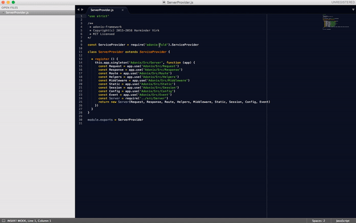

# ClickableRequires for Sublime Text 3

## Description
Open the required javascript files with a mouseclick as you are doing it in another IDEs.
The implementation of the file search is based on the Node.js's documentation.

> https://nodejs.org/api/modules.html#modules_all_together

## Installation
* clone the repository into Sublime Packages folder
* it is not yet available through Package Control :/

## Usage
You have to `CMD` or `CTRL` + click on the `require('your-module')` statement to open the source in a new tab.
For core node modules the online documentation will be opened in the browser.

